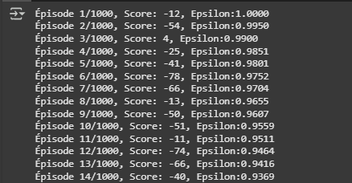

# Implémentation DQN et Double DQN en GridWorld

Le Deep Q-Network (DQN) combine les réseaux de neurones avec l'algorithme Q-Learning pour résoudre des problèmes complexes avec de grands espaces d'états. Ce rapport présente l'implémentation d'un agent DQN dans un environnement GridWorld 4x4. où l'agent apprend à se déplacer de (0,0) à (3,3) en évitant un obstacle à (1,1)

## Partie I - Implémentation d’un agent d'apprentissage par renforcement utilisant un Deep Q-Network (TP5)
Bibliothèques Utilisées
```python
import numpy as np                # Pour les opérations matricielles
import random                     # Pour l'exploration aléatoire
import tensorflow as tf           # Pour le réseau de neurones
from tensorflow.keras.models import Sequential
from tensorflow.keras.layers import Dense
from tensorflow.keras.optimizers import Adam
from collections import deque     # Pour la mémoire de replay (structure FIFO)
```

Définition des hyperparamètres et constantes
```python
GRID_SIZE = 4                     # Taille de la grille (4x4)
STATE_SIZE = GRID_SIZE * GRID_SIZE# 16 états possibles (encodage one-hot)
ACTION_SIZE = 4                   # 4 actions : Haut, Bas, Gauche, Droite
GAMMA = 0.9                       # Facteur de réduction des récompenses futures
LEARNING_RATE = 0.01              # Taux d'apprentissage pour l'optimiseur Adam
EPSILON = 1.0                     # Probabilité initiale d'exploration (100%)
EPSILON_MIN = 0.01                # Probabilité minimale d'exploration (1%)
EPSILON_DECAY = 0.995             # Taux de décroissance exponentielle d'epsilon
BATCH_SIZE = 32                    # Nombre d'expériences utilisées par batch
MEMORY_SIZE = 2000                 # Taille maximale de la mémoire de replay
EPISODES = 1000                    # Nombre total d'épisodes d'entraînement
```
Dictionnaire des déplacements possibles (action -> mouvement (dx, dy))
```python
MOVES = {
    0: (-1, 0),  # Haut (diminue la coordonnée x)
    1: (1, 0),   # Bas (augmente la coordonnée x)
    2: (0, -1),  # Gauche (diminue la coordonnée y)
    3: (0, 1)    # Droite (augmente la coordonnée y)
}
```
Environnement GridWorld
```python
class GridWorld:
    """Environnement GridWorld 4x4 avec un agent, un objectif et un obstacle."""
    
    def __init__(self):
        """Initialise la grille et les positions initiales."""
        self.grid_size = GRID_SIZE
        self.reset()  # Appel à reset() pour initialiser les positions
        
    def reset(self):
        """
        Réinitialise l'environnement :
        - Agent en (0,0)
        - Objectif en (3,3)
        - Obstacle en (1,1)
        Retourne l'état initial.
        """
        self.agent_pos = (0, 0)       # Position de départ de l'agent
        self.goal_pos = (3, 3)        # Position de l'objectif
        self.obstacle_pos = (1, 1)    # Position de l'obstacle
        return self.get_state()        # Retourne l'état initial
    
    def get_state(self):
        """
        Encode l'état actuel en vecteur one-hot de taille 16 (4x4).
        Exemple : Si l'agent est en (0,0) -> [1,0,0,...,0]
        """
        state = np.zeros((GRID_SIZE, GRID_SIZE))  # Grille 4x4 initialisée à 0
        state[self.agent_pos] = 1                 # Marque la position de l'agent
        return state.flatten()                    # Convertit en vecteur 1D
    
    def step(self, action):
        """
        Exécute une action et retourne :
        - next_state : nouvel état 
        - reward : récompense obtenue
        - done : booléen indiquant si l'épisode est terminé
        """
        x, y = self.agent_pos
        dx, dy = MOVES[action]         # Récupère le mouvement associé à l'action
        new_x, new_y = x + dx, y + dy  # Calcule la nouvelle position
        
        # Vérifie si la nouvelle position est dans la grille
        if 0 <= new_x < GRID_SIZE and 0 <= new_y < GRID_SIZE:
            self.agent_pos = (new_x, new_y)  # Met à jour la position
            
        # Calcul de la récompense et vérification de l'état terminal
        if self.agent_pos == self.goal_pos:
            # Objectif atteint : grosse récompense, épisode terminé
            return self.get_state(), 10, True
        elif self.agent_pos == self.obstacle_pos:
            # Obstacle touché : pénalité, épisode non terminé
            return self.get_state(), -5, False
        else:
            # Déplacement normal : petite pénalité pour encourager l'efficacité
            return self.get_state(), -1, False
```
Agent DQN
```python
class DQNAgent:
    """Agent DQN avec réseau de neurones, mémoire de replay et stratégie ε-greedy."""
    
    def __init__(self):
        """Initialise l'agent avec les paramètres et le modèle."""
        self.state_size = STATE_SIZE    # Taille de l'espace d'état (16)
        self.action_size = ACTION_SIZE  # Nombre d'actions possibles (4)
        self.memory = deque(maxlen=MEMORY_SIZE)  # Mémoire FIFO pour experience replay
        self.epsilon = EPSILON          # Taux d'exploration initial
        self.model = self._build_model()# Construction du réseau de neurones
        
    def _build_model(self):
        """
        Construit le modèle de réseau de neurones :
        - Deux couches cachées de 24 neurones avec ReLU
        - Couche de sortie linéaire pour les Q-values
        """
        model = Sequential([
            # Couche d'entrée : 16 neurones (état) -> 24 neurones cachés
            Dense(24, activation='relu', input_shape=(self.state_size,)),
            # Deuxième couche cachée : 24 neurones
            Dense(24, activation='relu'),
            # Couche de sortie : 4 neurones (Q-values pour chaque action)
            Dense(self.action_size, activation='linear')
        ])
        # Compilation avec MSE comme loss et Adam comme optimiseur
        model.compile(loss='mse', optimizer=Adam(learning_rate=LEARNING_RATE))
        return model
    
    def remember(self, state, action, reward, next_state, done):
        """
        Stocke une expérience dans la mémoire de replay.
        Format : (état, action, récompense, nouvel état, terminé)
        """
        self.memory.append((state, action, reward, next_state, done))
    
    def act(self, state):
        """
        Sélectionne une action selon la stratégie ε-greedy :
        - Exploration : action aléatoire avec probabilité ε
        - Exploitation : action optimale selon le modèle avec probabilité 1-ε
        """
        if np.random.rand() <= self.epsilon:
            # Exploration : choix aléatoire parmi les 4 actions
            return random.randrange(self.action_size)
        else:
            # Exploitation : prédiction des Q-values et choix de l'action max
            q_values = self.model.predict(np.array([state]), verbose=0)
            return np.argmax(q_values[0])  # Retourne l'indice de l'action optimale
    
    def replay(self):
        """
        Entraîne le modèle sur un batch d'expériences passées.
        Met à jour les Q-values selon l'équation de Bellman.
        """
        # Ne rien faire si pas assez d'expériences dans la mémoire
        if len(self.memory) < BATCH_SIZE:
            return
        
        # Échantillonage aléatoire d'un batch dans la mémoire
        batch = random.sample(self.memory, BATCH_SIZE)
        
        # Traitement de chaque expérience du batch
        for state, action, reward, next_state, done in batch:
            # Prédiction des Q-values actuelles pour l'état
            target = self.model.predict(np.array([state]), verbose=0)[0]
            
            if done:
                # Cas terminal : pas de récompense future
                target[action] = reward
            else:
                # Calcul de la Q-value cible avec l'équation de Bellman
                q_future = np.max(self.model.predict(np.array([next_state]), verbose=0)[0])
                target[action] = reward + GAMMA * q_future
            
            # Entraînement du modèle sur l'état et la cible mise à jour
            self.model.fit(np.array([state]), np.array([target]), epochs=1, verbose=0)
        
        # Décroissance exponentielle d'epsilon (sauf si déjà au minimum)
        if self.epsilon > EPSILON_MIN:
            self.epsilon *= EPSILON_DECAY
```
Entraînement
```python

# Initialisation de l'environnement et de l'agent
env = GridWorld()
agent = DQNAgent()

# Boucle sur les épisodes d'entraînement
for episode in range(EPISODES):
    state = env.reset()       # Réinitialise l'environnement
    total_reward = 0          # Récompense cumulée de l'épisode
    done = False              # Indicateur de fin d'épisode
    
    # Boucle sur les pas dans l'épisode (max 50 pas)
    for step in range(50):
        # Sélection d'une action par l'agent
        action = agent.act(state)
        
        # Exécution de l'action dans l'environnement
        next_state, reward, done = env.step(action)
        
        # Stockage de l'expérience dans la mémoire
        agent.remember(state, action, reward, next_state, done)
        
        # Mise à jour de l'état et de la récompense totale
        state = next_state
        total_reward += reward
        
        # Si l'épisode est terminé, sortir de la boucle
        if done:
            break
    
    # Entraînement de l'agent sur les expériences stockées
    agent.replay()
    
    # Affichage des résultats de l'épisode
    print(f"Épisode {episode+1}/{EPISODES}, Score: {total_reward}, Epsilon: {agent.epsilon:.4f}")

# Sauvegarde du modèle entraîné
agent.model.save("dqn_gridworld_model.keras")
print("Modèle sauvegardé sous dqn_gridworld_model.keras")
```
### Résultats
- Évolution du Score
  - Début d'entraînement : Scores faibles (ex: -66) en raison de l'exploration aléatoire.  
  - En fin d'entraînement : Scores stabilisés autour de +5 (objectif atteint rapidement)
- Décroissance d'Epsilon
  - Initial : epsilon = 1.0 (100% d'exploration).
  - Après 1000 épisodes : epsilon ≈ 0.01 (1% d'exploration).




### Limitations:
DQN surestime les Q-values car le même réseau de neurones est utilisé pour sélectionner l'action optimale et aussi évaluer la valeur de cette action cela crée une erreur de surestimation qui se propage dans la mise à jour.

la solution proposé pour stabiliser l'apprentissage est le double DQN.

## Partie II -  Implémentation d'un agent double Deep Q-Network dans un environnement GridWorld 4x4 (Devoir)
le double DQN vient pour résoudre un problème fondamental du DQN: la surestimation des Q-values abordé au-dessus.
le terme double représente le fait d'utilsé deux réseaux un pour sélectionner l'action et un autre pour évaluer la Q-value de cette action cela réduit la surestimation.

Les changement à apportés pour le Double DQN :
1. Ajout d'un réseau cible : Le réseau cible est une copie du réseau principal initialement.
    ````python
    self.target_model = self._build_model()
    self.target_model.set_weights(self.model.get_weights())
    ````
2. Mise à jour du réseau cible :
    ````python
    def update_target_network(self):
        # Méthode 1 : Copie complète périodique
        if self.update_counter % UPDATE_TARGET_EVERY == 0:
            self.target_model.set_weights(self.model.get_weights())
        self.update_counter += 1
    ````
3. Calcul des Q-values cibles avec Double DQN :
    ````python
    # 1. Sélection de l'action avec le réseau principal
    next_q_values = self.model.predict(next_state)[0]
    best_action = np.argmax(next_q_values)
    
    # 2. Évaluation avec le réseau cible : Séparation de la sélection et de l'évaluation pour réduire la surestimation.
    target_q_values = self.target_model.predict(next_state)[0]
    target[action] = reward + GAMMA * target_q_values[best_action]
    ````
   
code complet modifié pour implémenter le Double DQN

````python
# =============================================================================
# 1. Importations
# =============================================================================
import numpy as np
import random
import tensorflow as tf
from tensorflow.keras.models import Sequential, clone_model
from tensorflow.keras.layers import Dense
from tensorflow.keras.optimizers import Adam
from collections import deque

# =============================================================================
# 2. Hyperparamètres (la mise à jour périodique du réseau cible)
# =============================================================================
GRID_SIZE = 4
STATE_SIZE = GRID_SIZE * GRID_SIZE
ACTION_SIZE = 4
GAMMA = 0.9
LEARNING_RATE = 0.01
EPSILON = 1.0
EPSILON_MIN = 0.01
EPSILON_DECAY = 0.995
BATCH_SIZE = 32
MEMORY_SIZE = 2000
EPISODES = 1000
UPDATE_TARGET_EVERY = 10  # Mise à jour périodique du réseau cible

MOVES = {
    0: (-1, 0),  # Haut
    1: (1, 0),   # Bas
    2: (0, -1),  # Gauche
    3: (0, 1)    # Droite
}

# =============================================================================
# 3. Classe GridWorld (inchangée)
# =============================================================================

# =============================================================================
# 4. Classe DoubleDQNAgent (modifications clés ici)
# =============================================================================
class DoubleDQNAgent:
    def __init__(self):
        self.state_size = STATE_SIZE
        self.action_size = ACTION_SIZE
        self.memory = deque(maxlen=MEMORY_SIZE)
        self.epsilon = EPSILON
        
        # Réseau principal (online) pour la sélection des actions
        self.model = self._build_model()
        
        # Réseau cible (target) pour l'évaluation des Q-values
        self.target_model = self._build_model()
        self.target_model.set_weights(self.model.get_weights())  # Initialisation identique
        
        self.update_counter = 0  # Compteur pour les mises à jour périodiques

    def _build_model(self):
        """Construit le réseau de neurones (identique au DQN classique)."""
        model = Sequential([
            Dense(24, activation='relu', input_shape=(self.state_size,)),
            Dense(24, activation='relu'),
            Dense(self.action_size, activation='linear')
        ])
        model.compile(loss='mse', optimizer=Adam(learning_rate=LEARNING_RATE))
        return model

    def update_target_network(self):
        """Met à jour le réseau cible de deux manières possibles :"""
        # Méthode 1 : Copie complète périodique
        if self.update_counter % UPDATE_TARGET_EVERY == 0:
            self.target_model.set_weights(self.model.get_weights())
        
        # Méthode 2 : Mise à jour progressive (décommenter pour utiliser)
        # target_weights = self.target_model.get_weights()
        # online_weights = self.model.get_weights()
        # new_weights = [(1-TAU)*tw + TAU*ow for tw, ow in zip(target_weights, online_weights)]
        # self.target_model.set_weights(new_weights)
        
        self.update_counter += 1

    def remember(self, state, action, reward, next_state, done):
        """Identique au DQN classique."""
        self.memory.append((state, action, reward, next_state, done))

    def act(self, state):
        """Identique au DQN classique."""
        if np.random.rand() <= self.epsilon:
            return random.randrange(self.action_size)
        q_values = self.model.predict(np.array([state]), verbose=0)
        return np.argmax(q_values[0])

    def replay(self):
        """Modification clé : Utilise le Double DQN pour le calcul des cibles."""
        if len(self.memory) < BATCH_SIZE:
            return

        batch = random.sample(self.memory, BATCH_SIZE)
        
        for state, action, reward, next_state, done in batch:
            # Prédiction des Q-values actuelles avec le réseau principal
            target = self.model.predict(np.array([state]), verbose=0)[0]
            
            if done:
                target[action] = reward
            else:
                # Double DQN : 
                # 1. Sélection de l'action avec le réseau principal
                next_q_values = self.model.predict(np.array([next_state]), verbose=0)[0]
                best_action = np.argmax(next_q_values)
                
                # 2. Évaluation de la Q-value avec le réseau cible
                target_q_values = self.target_model.predict(np.array([next_state]), verbose=0)[0]
                target[action] = reward + GAMMA * target_q_values[best_action]
            
            # Entraînement du réseau principal uniquement
            self.model.fit(np.array([state]), np.array([target]), epochs=1, verbose=0)
        
        # Mise à jour du réseau cible
        self.update_target_network()
        
        # Décroissance d'epsilon
        if self.epsilon > EPSILON_MIN:
            self.epsilon *= EPSILON_DECAY

# =============================================================================
# 5. Boucle d'entraînement (identique, sauf le nom de l'agent)
# =============================================================================
if __name__ == "__main__":
    env = GridWorld()
    agent = DoubleDQNAgent()  # Changement ici
    
    for episode in range(EPISODES):
        state = env.reset()
        total_reward = 0
        done = False
        
        for step in range(50):
            action = agent.act(state)
            next_state, reward, done = env.step(action)
            agent.remember(state, action, reward, next_state, done)
            state = next_state
            total_reward += reward
            if done:
                break
        
        agent.replay()
        print(f"Épisode {episode+1}/{EPISODES}, Score: {total_reward}, Epsilon: {agent.epsilon:.4f}")
    
    agent.model.save("double_dqn_gridworld.keras")
    print("Modèle sauvegardé sous double_dqn_gridworld.keras")
````
